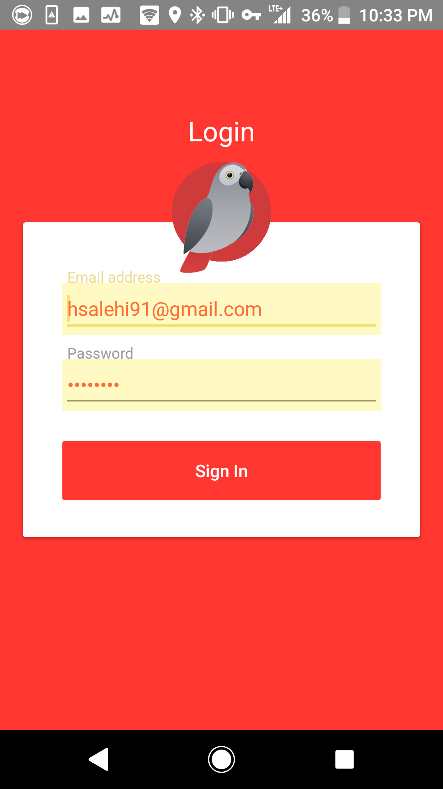
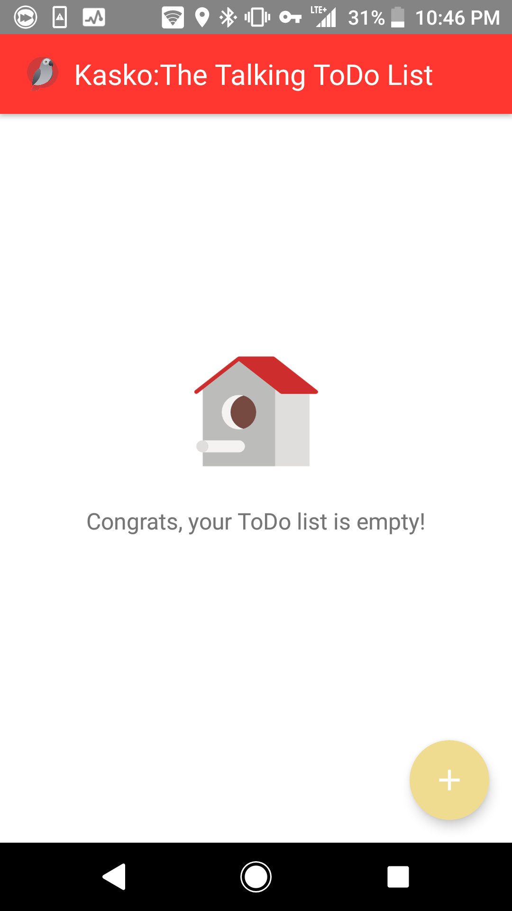
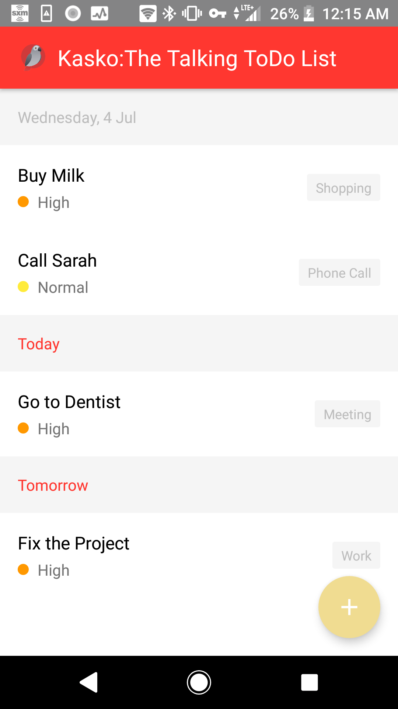
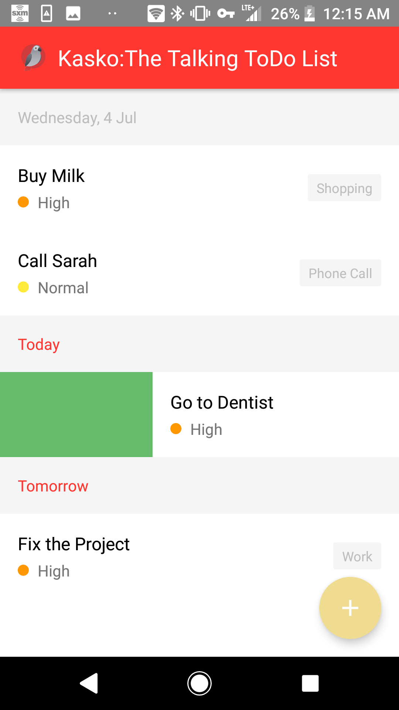
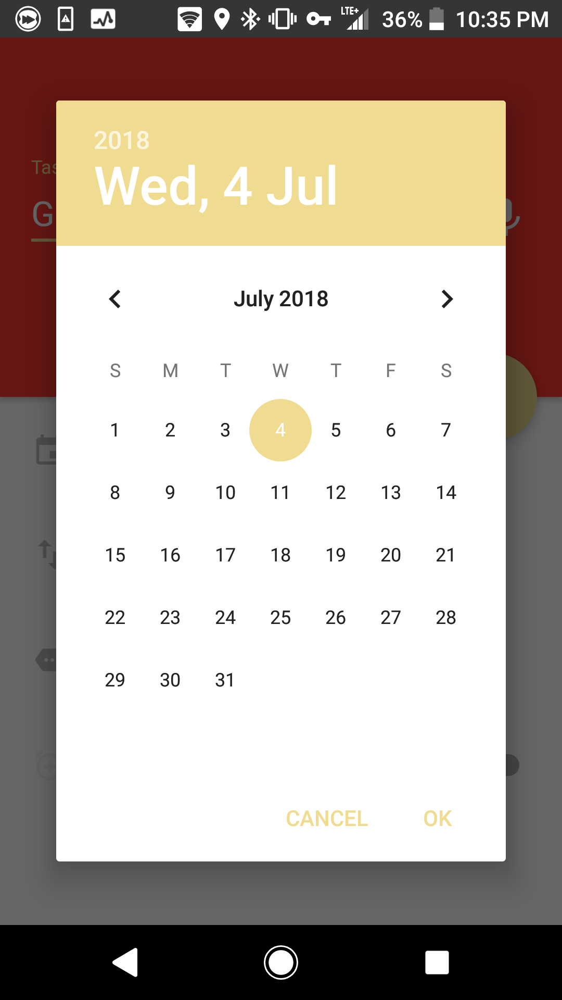
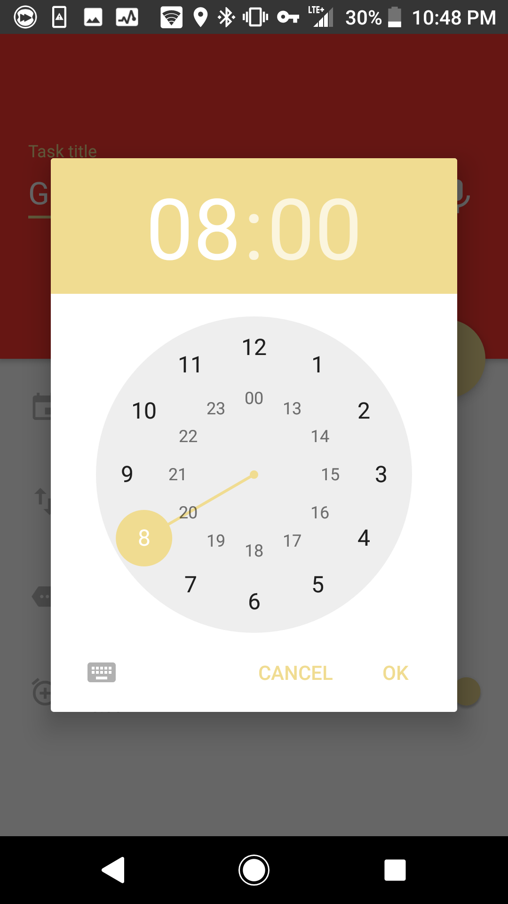
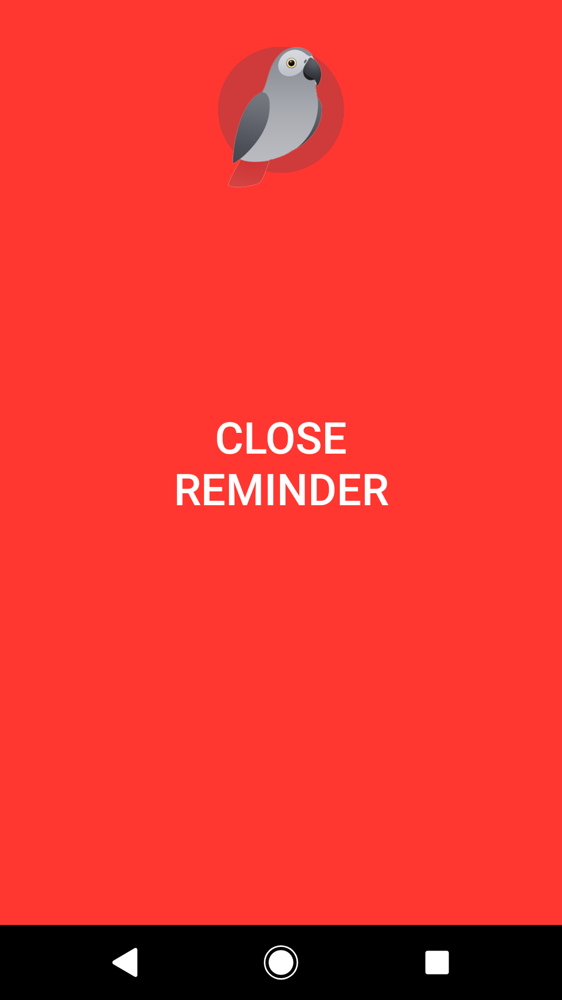
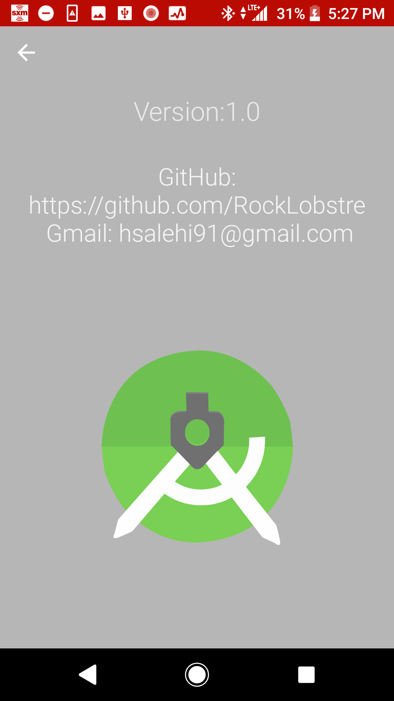

# Kasko

**[Download APK](https://github.com/RockLobstre/Kasko/blob/master/kasko.apk?raw=true)**

## What is Kasko?

Kasko is a Talking To-do List app, which allows the user to set up Reminders with Priorities, Tags and an audible Reminding Message.

### Login Screen

### To-Do List

### Creating Task

### Date and Time Picker

### Reminder Screen

### About

## Tools
* Firebase
* Dependency Injection (Dagger 2)
* ButterKnife
* RxJava 2, RxAndroid, RxFirebase

## Pattern
* **MVP**: Model-View-Presenter
* **MVVM**: Model-View-ViewModel (using Android Data Binding)

## Clean Architecture
The project is following a [Clean architecture](https://8thlight.com/blog/uncle-bob/2012/08/13/the-clean-architecture.html) approach.

## Contact
It's my personal goal to create high-quality content, I'v been writing quality apps for almost 5 years and I passionate myself for what I do, and I'm glad if you would like to work with me.

- [Gmail](mattinn91@gmail.com)(hsalehi91@gmail.com)

## License
 * Copyright 2017, The Android Open Source Project
 *
 * Licensed under the Apache License, Version 2.0 (the "License");
 * you may not use this file except in compliance with the License.
 * You may obtain a copy of the License at
 *
 *      http://www.apache.org/licenses/LICENSE-2.0
 *
 * Unless required by applicable law or agreed to in writing, software
 * distributed under the License is distributed on an "AS IS" BASIS,
 * WITHOUT WARRANTIES OR CONDITIONS OF ANY KIND, either express or implied.
 * See the License for the specific language governing permissions and
 * limitations under the License.
 *
